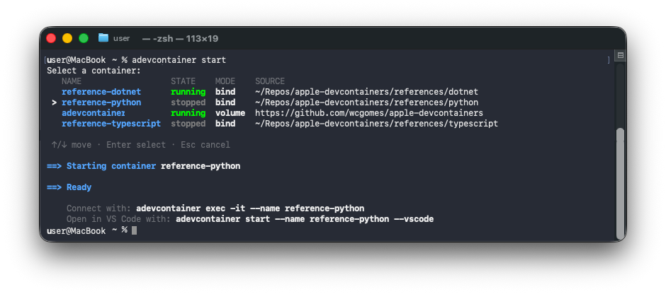
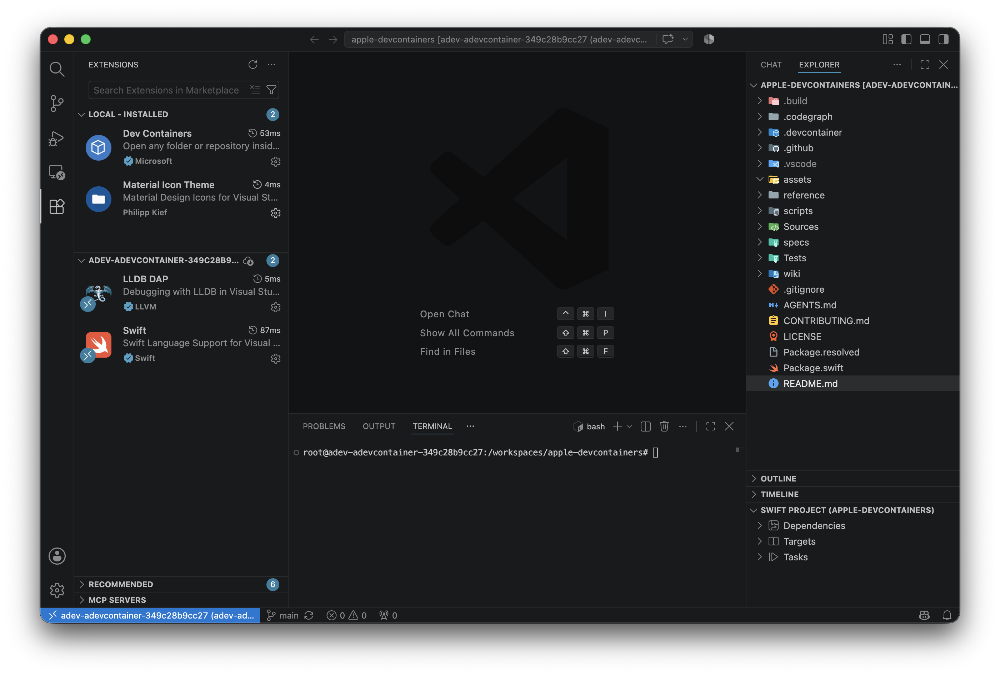

# Apple Dev Container CLI (adevcontainer)

[](https://github.com/wcgomes/apple-devcontainers/actions/workflows/ci.yml)
[](https://github.com/wcgomes/apple-devcontainers)
[](LICENSE)

Native Swift CLI that reads `devcontainer.json` and runs development environments on Apple [`container`](https://github.com/apple/container).

Use `up` with an existing checkout, or use `clone` to keep the repository in a named volume for faster I/O. Work from your terminal, an AI agent or VS Code.



For implementation details and behavior beyond this quick reference, see the [technical documentation](wiki/index.md).

## Requirements

- macOS 26+ on Apple Silicon
- Apple [`container`](https://github.com/apple/container), installed separately

## Install

### Homebrew (recommended)

```bash
brew install wcgomes/tap/adevcontainer
```

### Release binary

Download `adevcontainer-macos-arm64.tar.gz` and `adevcontainer-macos-arm64.tar.gz.sha256` from [GitHub Releases](https://github.com/wcgomes/apple-devcontainers/releases), then run:

```bash
shasum -a 256 -c adevcontainer-macos-arm64.tar.gz.sha256
tar xzf adevcontainer-macos-arm64.tar.gz
sudo mv adevcontainer /usr/local/bin/ # or move it to another directory on PATH
```

Verify the installation and Apple `container` setup:

```bash
adevcontainer doctor
```

To build from source, follow [CONTRIBUTING.md](CONTRIBUTING.md).

## Quick start

Your project must contain `.devcontainer/devcontainer.json` or `.devcontainer.json`.

### Use a local checkout

From the project directory:

```bash
adevcontainer up
adevcontainer exec -it
```

> **Tip:** Apple Containers works differently from other container runtimes: it uses a lightweight VM per container instead of sharing one super VM, but its default resources can be low or insufficient for dev containers; if a container is unresponsive, consider setting `hostRequirements` in `devcontainer.json`.

To use another local directory, run `adevcontainer up -w <path>`.

### Clone into a named volume

You do not need a local checkout. Use an HTTPS or SSH Git URL:

```bash
adevcontainer clone https://github.com/org/repo.git
adevcontainer list
adevcontainer exec --name <name> -it
```

The cloned source remains in a named volume. You can work, commit, and push from inside the container.

## Commands

| Command | Purpose |
| --- | --- |
| `adevcontainer doctor` | Check Apple `container` readiness |
| `adevcontainer up [-w <path>] [--vscode]` | Create or start a dev container from a local folder |
| `adevcontainer clone <git-url> [--vscode]` | Clone a repository into a named volume and start its dev container |
| `adevcontainer exec [-it] [--name <name>] [--] [cmd…]` | Open a shell or run a command in a running managed container |
| `adevcontainer list [--json]` | List managed dev containers |
| `adevcontainer start [--vscode] \| stop \| inspect [--name <name>]` | Manage a container by name or with the interactive picker |
| `adevcontainer delete [--name <name>]` | Remove a container, keeping its managed volumes |
| `adevcontainer prune [--name <name>]` | Remove a container, its managed volumes, and the image |
| `adevcontainer rebuild [--name <name>] [--vscode]` | Rebuild a managed container from its current configuration |
| `adevcontainer help [<command>]` | Show main usage or per-command help |
| `adevcontainer version [--version]` | Print the CLI version |

## Visual Studio Code integration

Make sure the [Remote - Containers extension](https://marketplace.visualstudio.com/items?itemName=ms-vscode-remote.remote-containers) is installed and the `code` CLI is available. Then add `--vscode` to `up`, `clone`, `start`, or `rebuild`:

```bash
adevcontainer up --vscode
```

The CLI applies supported VS Code settings and extensions from `devcontainer.json`, then opens the remote workspace so the first attach can see the installed registry.



## Contributing

See [CONTRIBUTING.md](CONTRIBUTING.md) for prerequisites, source builds, tests, fixtures, and the repository development workflow.

Technical design and project decisions are documented in the [wiki](wiki/index.md).

## License

This project is available under the [MIT License](LICENSE).
